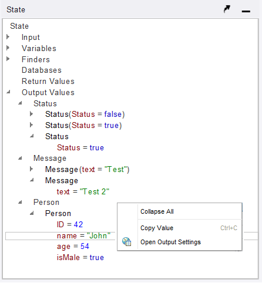
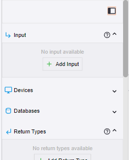

# Kofax RPA 11.5
Due for release early October 2023.
## New Features
### Robots
  * Robots can now run **stand-alone** without a host Basic Engine Robot.
    * If your robot returns more than 1 result, you need to 
      * use the [Output Value](https://docshield.kofax.com/RPA/en_US/11.5.0-nlfihq5gwr/help/rpa_help/help_main/designstudio/c_dasoutputvaluestep.html) Step to return multiple values.
      * you also need to remove the return types.  
      
      * This means your robot can NO longer be called from a Basic Engine Robot, because the BER is expecting only 1 result being returned from the Return step.
      * it also means that your robot can return a mixture of various types.
      * The debugger only shows the latest 20 results per return Type. This amount can be changed.
      
  * Input Parameters now have **Test Values** and icons for Types.   
  
  * Output Values are shown in State View.  
  
  * Robot *Side Panel* with Editors. the robot config is now "floating" above the robot and not off to the left of the robot. You can view/edit robot settings within the middle of the robot.  
  
  * Chromium Embedded Framework (CEF) now has standalone executable for more frequent upgrading. This will still require a patch created by Kofax, but it will be much easier to build and deliver.
  * CEF has built in Google's Chrome Debugger.
  * **Open Email** Step from BER has been added to Robots to allow easily handling of headers, subject, body and all attachments.
### Basic Engine Robots
  * The very old Classic Browser has been removed. it was deprecated in version 11.x?
  * The webkit(?) engine is still available for BER.
### Management Console
  * New login for users using tokens.
    * When opening DS for the first time, it transfers you to a webpage for the MC. If you are logged into to MC with admin, then you are automatically given a token for user "admin" in the DS.
    * To login to DS as a normal user.
      * login to MC as admin
      * Create a user in MC/admin/users&groups/users.
      * Create a group *developers* in MC/admin/users&groups/groups and add the user to this group.
      * Add the group to roles in projects in MC/admin/projects.
      * logout of MC.
      * Start DS.
      * It will take you to MC. Log in as the normal user.
      * the browser will close and you will be taken back to DS.
      * When you upload robots to MC, your user name will appear in modified column in MC/robots/repository, if you unhide the *created by* or *modified by* column.
      * You don't have to log in to DS any time in the future.
  * "Message of the Day" feature added. 
    * This is a message from the MC Admin to any user that logs into the MC. These messages are not visible in DS.
    * colors and expiry date can be set.
    * This will also help with communicating to RPA Cloud users.
### Roboservers
  * Remote Roboservers.
  * Roboserver Distribution and Scaling
  * Only one Roboserver allowed per machine ??
### Robot File System
  * RFS can now be access from embedded Excel.
  * Files can be uploaded from RFS to embedded Browser (CEF).
### Cloud
  * Cloud Readiness Guide.
  * Token-based authentication to Management Console from Design Studio, Roboserver, Robot File System and Document Transformation Service.
* Kofax Total Agility Integration
  * Unifield Licensing with Kofax Total Agility.
  * Robots can be called directly from KTA, and KTA Quick Robots without requiring an intermediate BER.
    * There is a new **Return** Step in Robots to return multiple results.
  * Application Analytics
## Docker
  * Kofax RPA no longer supports RedHat Linux. We only support Ubuntu Linux.
  * Installing RPA on Windows on Docker is no longer supported.
  * Installing RPA on Ubuntu on Docker on Windows is supported.
  * Installing RPA on Ubuntu on Docker on Cloud is supported and how Kofax' own RPA Cloud works.
